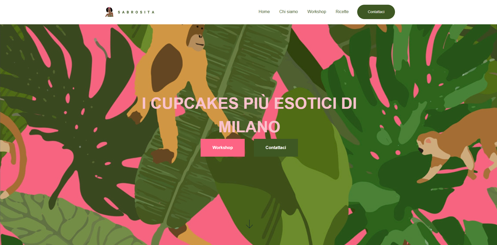

<h1>Project Sabrosita</h1>

A static website built with Hugo, HTML, and CSS, designed for simplicity, responsiveness, and ease of customization. The website is structured into four key sections: Home, Chi Siamo, Workshops, and Ricette, making it ideal for showcasing content in an elegant and organized manner.

## Features

- **Static Website**: Built using Hugo for optimal performance and simplicity.
- **Modern Design**: Fully responsive and crafted using HTML and CSS.
- **Organized Sections**:
  - **Home**: Welcoming landing page.
  - **Chi Siamo**: About us section to share your story.
  - **Workshops**: Highlight upcoming or past workshops.
  - **Ricette**: Showcase recipes in an attractive layout.
- **Customizable**: Easily modify content and design elements.
- **SEO Ready**: Configured for search engine optimization.

---

## Support

If you have any questions or need assistance, feel free to reach out via [Contact Me].

---

## Licensing

This repository is licensed under the Copyright.
